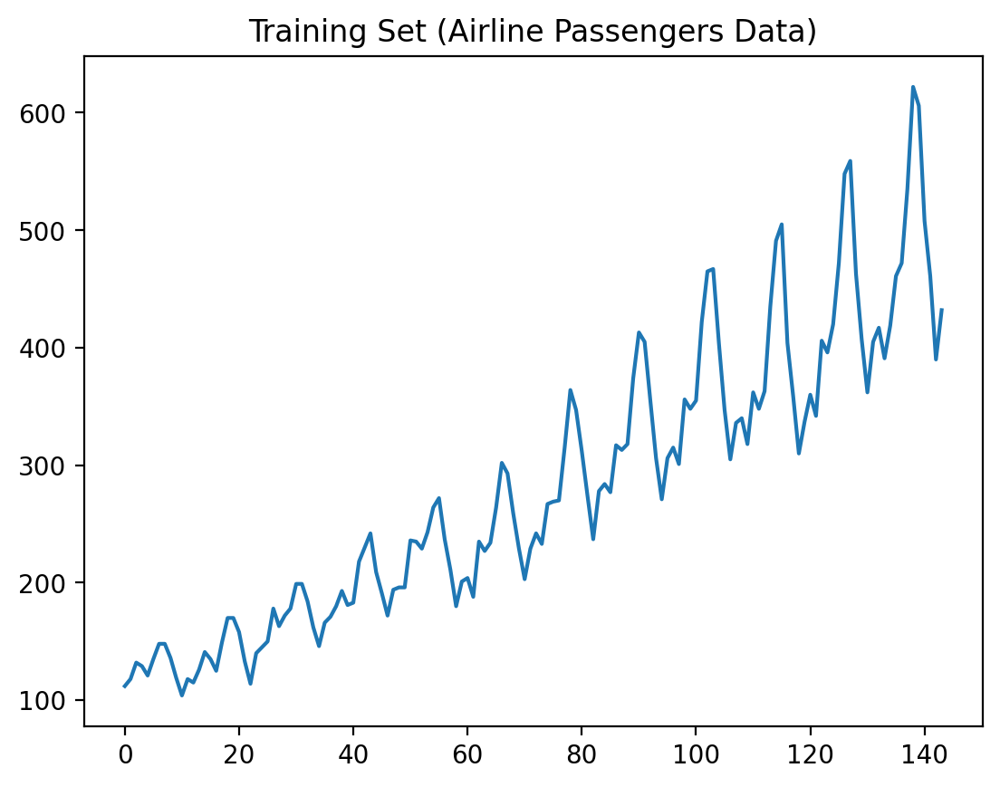
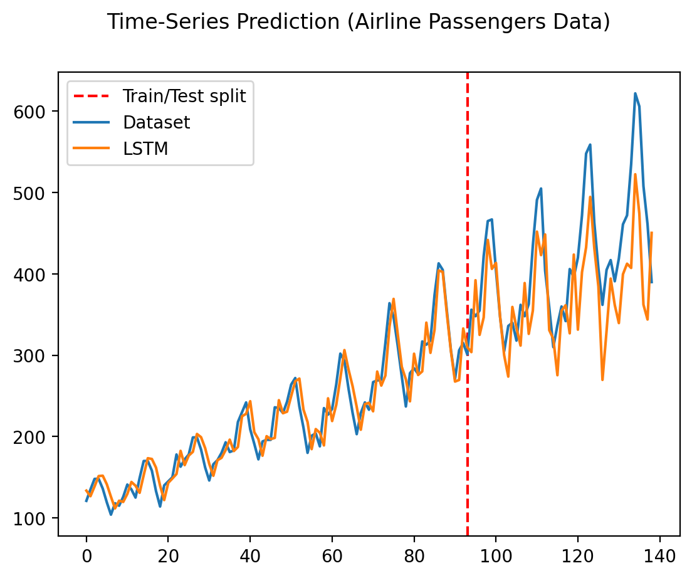
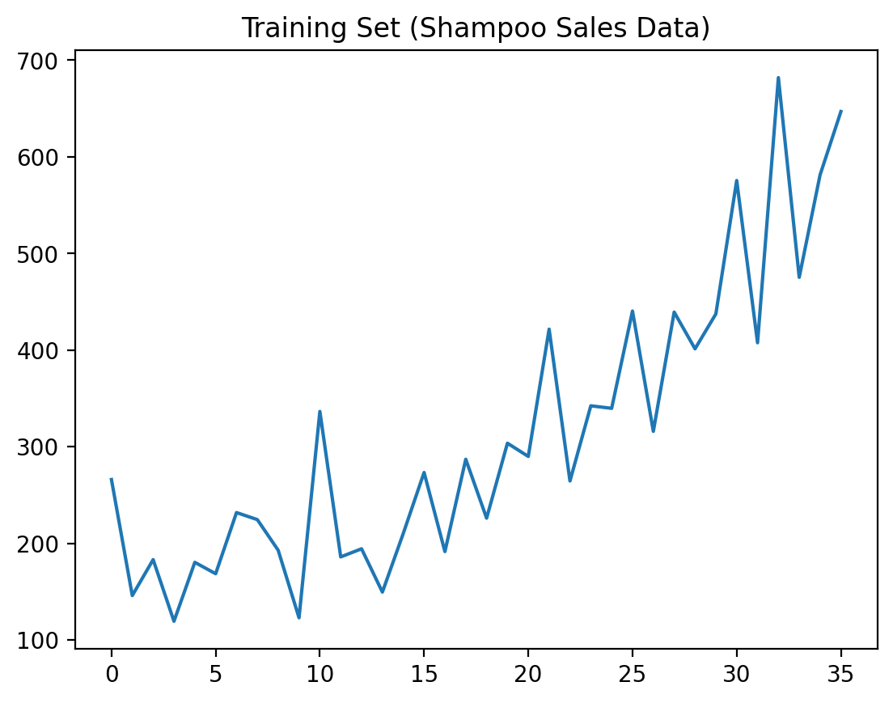
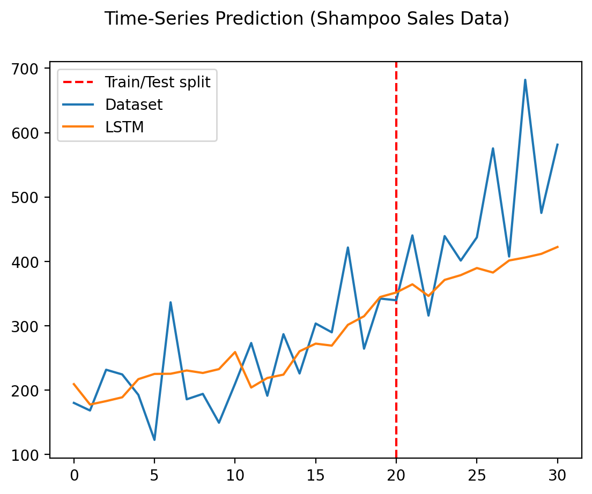
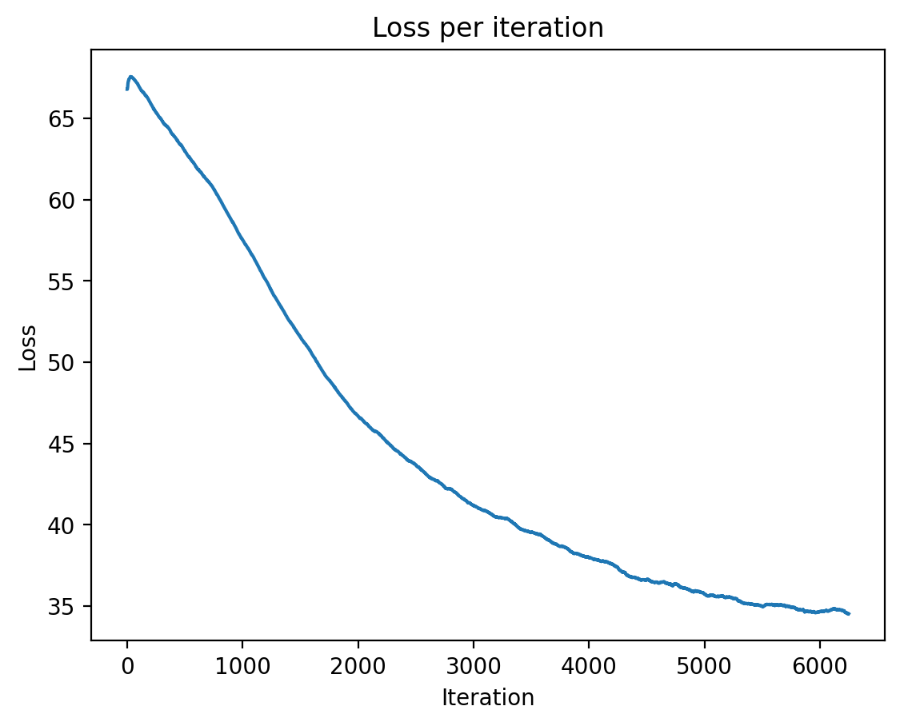
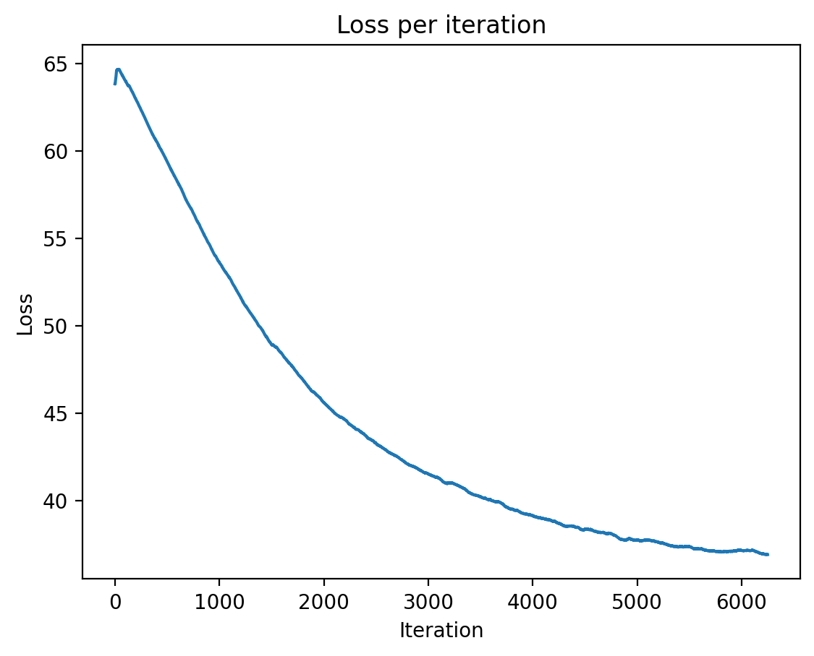
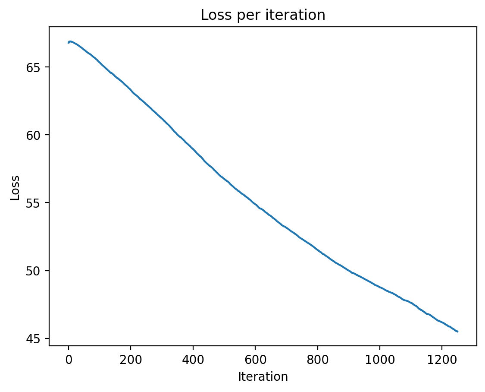
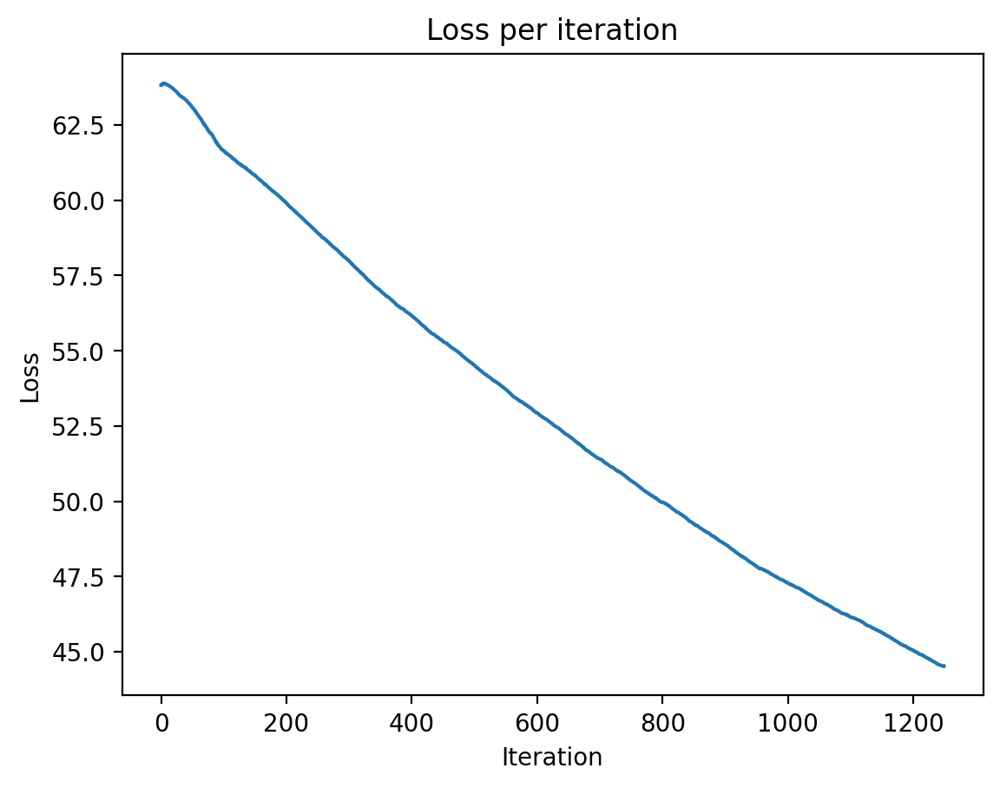

# Отчет по лабораторной работе 3

В лабораторной работе были исследованы рекуррентные сети для числовых последовательностей и для посимвольного моделирования текста. В ходе выполнения я изучил реализацию `src/rnn/lstm_torch.py`, `src/rnn/min_char_rnn_class.py` и `src/rnn/min_char_lstm.py`, прогнал все основные режимы, сохранил графики обучения и примеры генерации текста, а также оформил отдельный сценарий для повторяемого запуска экспериментов: `scripts/sem2/run_lab3_report.py`.

## 3.2 Общий план выполнения работы

1. Изучить код `src/rnn/lstm_torch.py` для работы с рекуррентной сетью LSTM, встроенной в `torch.nn`.
2. Запустить и проанализировать результаты для числовых последовательностей `airline-passengers.csv` и `shampoo.csv`.
3. Изучить код моделей `min-char-rnn` и `min-char-lstm`, сопоставить элементы обычной РНС и LSTM с методическими указаниями.
4. Разобраться в алгоритмах прямого и обратного прохода, обучения и генерации текста.
5. Добавить сохранение графиков качества обучения и фиксацию времени выполнения в отчетные артефакты.
6. Обучить и проверить модели `min-char-rnn` и `min-char-lstm` на текстах `input.txt` и `cnus-clean.txt`.
7. Сохранить графики обучения и примеры генерации текста для отчета.
8. Свести выводы по сравнению моделей и по поведению loss на разных типах данных.

## 3.3 Содержание отчета

В отчет входят:

1. Исполняемые файлы с модификациями:
   - `scripts/sem2/run_lab3.py`
   - `scripts/sem2/run_lab3_report.py`
2. Результаты обучения и исследования в виде графиков и примеров генерации:
   - `docs/sem2/lab3/assets/airline.data.png`
   - `docs/sem2/lab3/assets/airline.png`
   - `docs/sem2/lab3/assets/shampoo.data.png`
   - `docs/sem2/lab3/assets/shampoo.png`
   - `docs/sem2/lab3/assets/min_char_rnn_input.png`
   - `docs/sem2/lab3/assets/min_char_rnn_cnus_clean.png`
   - `docs/sem2/lab3/assets/min_char_lstm_input.png`
   - `docs/sem2/lab3/assets/min_char_lstm_cnus_clean.png`
3. Файлы с примерами сгенерированного текста:
   - `docs/sem2/lab3/assets/min_char_rnn_input_sample.txt`
   - `docs/sem2/lab3/assets/min_char_rnn_cnus_clean_sample.txt`
   - `docs/sem2/lab3/assets/min_char_lstm_input_sample.txt`
   - `docs/sem2/lab3/assets/min_char_lstm_cnus_clean_sample.txt`
4. Сохраненные веса моделей:
   - `models/min_char_rnn_input.npz`
   - `models/min_char_rnn_cnus_clean.npz`
   - `models/min_char_lstm_input.npz`
   - `models/min_char_lstm_cnus_clean.npz`

## Результаты и анализ

### 1. LSTM для числового ряда `airline-passengers.csv`

#### Исходный ряд

#### Прогноз модели

На графике видно выраженный сезонный рост числа пассажиров. Модель LSTM в целом повторяет тренд и сезонные колебания, но сглаживает пики и чуть запаздывает на экстремумах. После линии разделения train/test предсказание остается правдоподобным, однако амплитуда всплесков у модели ниже, чем у исходного ряда. Это типичное поведение для небольшой однолистной LSTM на коротком временном ряде: общий тренд воспроизводится хорошо, а резкие колебания частично усредняются.

### 2. LSTM для числового ряда `shampoo.csv`

#### Исходный ряд

#### Прогноз модели

В этом ряде разброс заметно сильнее, чем в `airline-passengers.csv`. Модель также ловит общий восходящий тренд, но пики и провалы воспроизводит хуже. На тестовом участке предсказание выглядит более сглаженным и «консервативным», чем исходный ряд, что говорит о высокой шумности данных и ограниченной выразительности простой LSTM с небольшим числом скрытых нейронов. Тем не менее модель не расходится и сохраняет корректную форму тренда.

### 3. `min-char-rnn` на `input.txt`

#### График loss

#### Пример генерации

Файл с примером: `assets/min_char_rnn_input_sample.txt`

При обучении loss монотонно убывает примерно с 66.8 до 34.7 на коротком отчетном прогоне. Это означает, что модель действительно выучивает локальные символные зависимости. Однако генерация остается шумной: слова и знаки препинания появляются в духе исходного текста, но структура предложений и орфография еще сильно искажены. Для обычной РНС это ожидаемо, потому что она хуже удерживает долгую контекстную информацию.

### 4. `min-char-rnn` на `cnus-clean.txt`

#### График loss

#### Пример генерации

Файл с примером: `assets/min_char_rnn_cnus_clean_sample.txt`

На более крупном корпусе loss снижается с 63.8 до 36.9. График гладкий и без признаков расходимости. Сгенерированный текст остается шумным, но выглядит чуть более осмысленно, чем на `input.txt`: чаще появляются английские слова, пробелы и пунктуация. В то же время качество все еще ограничено, и модель заметно теряет структуру на длинных фрагментах.

### 5. `min-char-lstm` на `input.txt`

#### График loss

#### Пример генерации

Файл с примером: `assets/min_char_lstm_input_sample.txt`

На укороченном отчетном прогоне loss падает примерно с 66.8 до 46.2 за 20k шагов. Снижение плавное и устойчивое. По сравнению с обычной РНС текст получается более структурированным: модель лучше держит заглавные буквы, диалоги и разрывы строк, а также чаще воспроизводит характерную для исходного текста ритмику реплик. Это подтверждает, что LSTM лучше хранит контекст и дает более стабильные последовательности.

### 6. `min-char-lstm` на `cnus-clean.txt`

#### График loss

#### Пример генерации

Файл с примером: `assets/min_char_lstm_cnus_clean_sample.txt`

Здесь loss снижается примерно с 63.8 до 45.0 за 20k шагов. Текст получается более похожим на английский, чем у `min-char-rnn`: чаще встречаются устойчивые словоформы, пробелы и фрагменты слов, а локальная грамматика держится лучше. При этом модель все еще далека от полноценного языкового моделирования, что ожидаемо для короткого обучения и минималистичной реализации.

## Итоговые выводы

1. Для числовых рядов LSTM уверенно воспроизводит общий тренд и сезонность, но сглаживает резкие пики.
2. Для текстовой генерации `min-char-lstm` заметно стабильнее и качественнее обычной `min-char-rnn`.
3. На обоих текстовых корпусах loss убывает монотонно, что говорит о корректной реализации прямого и обратного прохода.
4. Более длинный и шумный корпус требует большего времени обучения, но не приводит к расходимости.
5. Сохранение графиков и примеров генерации удобно для сравнения моделей и для демонстрации результата на защите.

## 4. Контрольные вопросы

1. Что такое рекуррентные нейронные сети (РНС)?
   РНС — это нейронные сети, которые обрабатывают последовательности и используют скрытое состояние для переноса информации между временными шагами.

2. В чем заключается основная идея использования рекуррентных связей в нейронных сетях?
   Идея состоит в том, чтобы учитывать предыдущий контекст при обработке текущего элемента последовательности.

3. Какие задачи можно решать с помощью рекуррентных нейронных сетей?
   Классификацию и генерацию текста, анализ временных рядов, распознавание речи, прогнозирование последовательностей и другие задачи с порядком во входных данных.

4. Какова структура базового рекуррентного блока в РНС?
   Базовый блок обычно содержит вход, скрытое состояние, линейное преобразование и функцию активации, например `tanh`.

5. Как происходит передача информации внутри рекуррентной нейронной сети на каждом временном шаге?
   На каждом шаге текущий вход объединяется с прошлым скрытым состоянием, после чего вычисляется новое скрытое состояние.

6. Как обучаются рекуррентные нейронные сети?
   Они обучаются методом обратного распространения ошибки во времени, то есть BPTT.

7. Как преодолеть проблему затухающих и взрывающихся градиентов в рекуррентных сетях?
   Используют LSTM/GRU, обрезку градиентов, нормализацию и корректный выбор инициализации.

8. Как выбрать функцию активации для рекуррентных нейронных сетей?
   Для скрытого состояния часто используют `tanh` или `ReLU`, а для ворот в LSTM/GRU — сигмоиду.

9. Как происходит обучение рекуррентных нейронных сетей на последовательных данных?
   Последовательность разбивается на окна, на каждом окне выполняется прямой проход, затем ошибка распространяется назад по времени.

10. Что такое LSTM (Long Short-Term Memory) в контексте РНС?
    LSTM — это разновидность РНС с ячейкой памяти и воротами, которые помогают хранить важную информацию дольше.

11. Какие проблемы решает механизм LSTM в сравнении с обычными рекуррентными сетями?
    LSTM лучше справляется с длинными зависимостями и снижает проблему затухающих градиентов.

12. Какова структура основного LSTM блока?
    В него входят ворота забывания, входа и выхода, а также состояние ячейки и скрытое состояние.

13. Как LSTM сохраняет и обрабатывает долгосрочные зависимости в данных?
    За счет состояния ячейки, которое частично сохраняется, обновляется и фильтруется воротами.

14. Как происходит передача информации через ворота (gates) в LSTM?
    Ворота управляют тем, какая часть информации сохраняется, добавляется или передается дальше.

15. Какие компоненты включают в себя ворота LSTM: вход, забывания и вывода?
    Входные ворота определяют, что добавить в память, ворота забывания — что удалить, а выходные — что передать наружу.

16. Как реализовать однонаправленные РНС в PyTorch?
    Обычно используют `torch.nn.RNN` или собственный модуль `nn.Module`, подают последовательность слева направо и сохраняют скрытое состояние между шагами.

17. Как реализовать однонаправленные LSTM в PyTorch?
    Аналогично, но используют `torch.nn.LSTM`, а на выходе берут скрытые состояния и полносвязный слой для целевой задачи.

## Примечание по запуску

Для повторяемого запуска экспериментов использовался `scripts/sem2/run_lab3_report.py`, который сохраняет графики и примеры генерации в `docs/sem2/lab3/assets/`.
